<h1 align="center">💷 Currency Denomination Detection using YOLO</h1>
 
<h2>Step 1:- Gathering Data</h2>
<ul> 
    <li>Gather images of the objects you want your model to detect
    <li>In this Case we Used Indian Currencies of diffrent denominations (ie. 10,20,50,100,200,500,2000)
    <li>For a smaller dataset, take about 30-40 images per object(If you are training on apples and oranges, for examples, find 30-40 different images of apples, and 30-40 for oranges)
    <li>Look for images that have different angles, colors, etc. Regarding the apples and oranges, try to find a variety of shapes and colors.
 </ul>

  
 
 You Can Obtain DataSets from This Website https://www.kaggle.com/ 

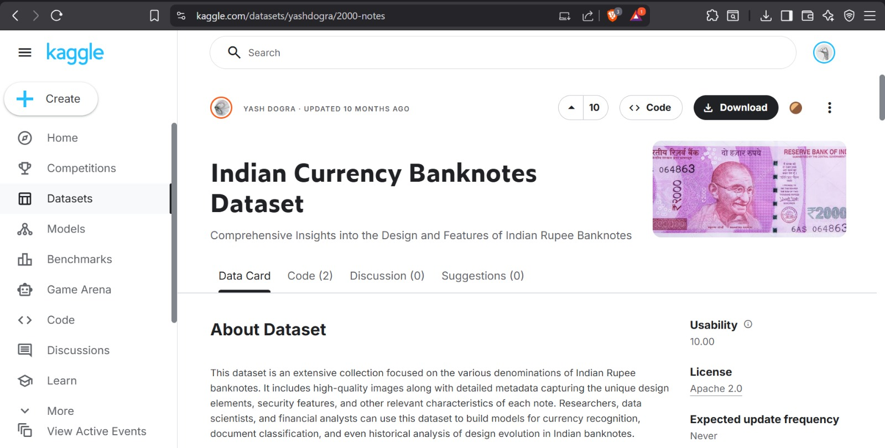

<h2>Step 2:- Annotating</h2>
<ul> 
    <li>Annotating is the process of drawing a box around the object in a photo, and giving it a name.  
    <li>This process tells the AI model that “This object is in this location, looks like this, and is called this” 
    <li> We will be using a free website called Roboflow to annotate, but there are others like it.
 </ul>

<h3>How to Annotate </h3>

1. Open https://roboflow.com/ and create an account 

2. Create a workspace, Select public plan and continue.

3. Create a project 

4. Fill in name, Annotation group, select “Object Detection,” and create project: 

5. Navigate to the “Upload Data” tab and upload your images 

6. Click on “Start Labeling,” “Assign to myself,” 

7. To label the image, draw a box around the object and enter the name of the it 

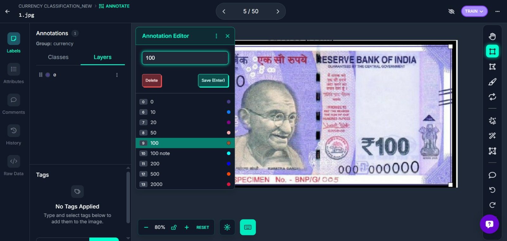

8. Once all images are annotated, Navigate to the “Annotated” tab on the left and click “Add to Dataset” on the top right. 

9. After Annotating , you can preview your DataSet 

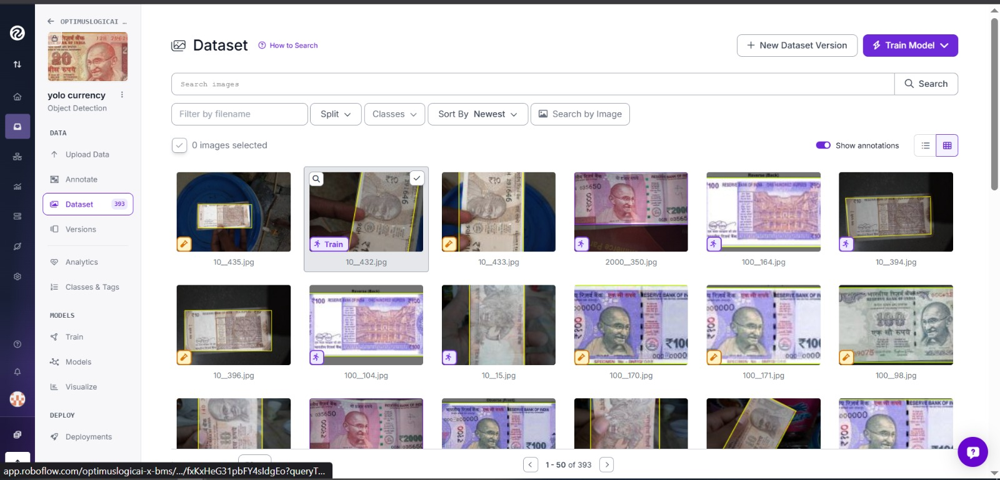

10. Split images between a train, valid, and test set. This is necessary. The recommended split is good. 

11. On the versions tab(left), follow the steps to create a version.  
a. Augmentation could prove useful for you, because it duplicates images and 
introduces imperfections, which could strengthen the accuracy of your model in 
imperfect situations. 

12. Create the version. We will get back to this later.

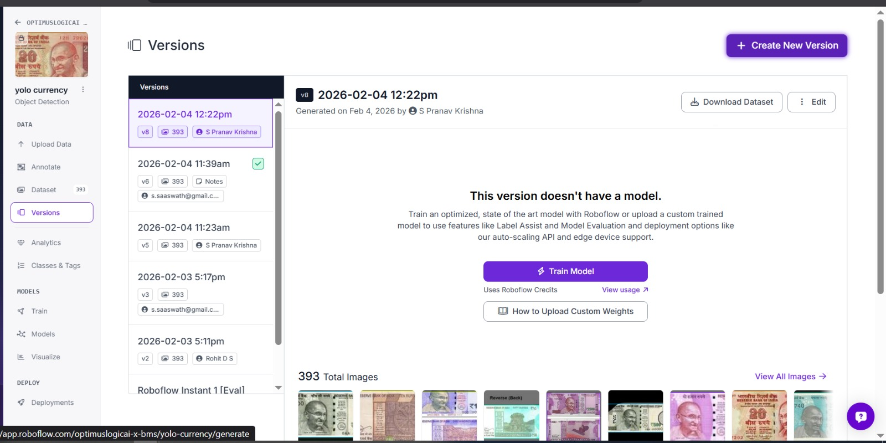

<h2>Step 3:- Training The Yolo Model</h2>

1. Open A Colab File ([Colab](https://colab.research.google.com/github/roboflow-ai/notebooks/blob/main/notebooks/train-yolo11-object-detection-on-custom-dataset.ipynb)) 

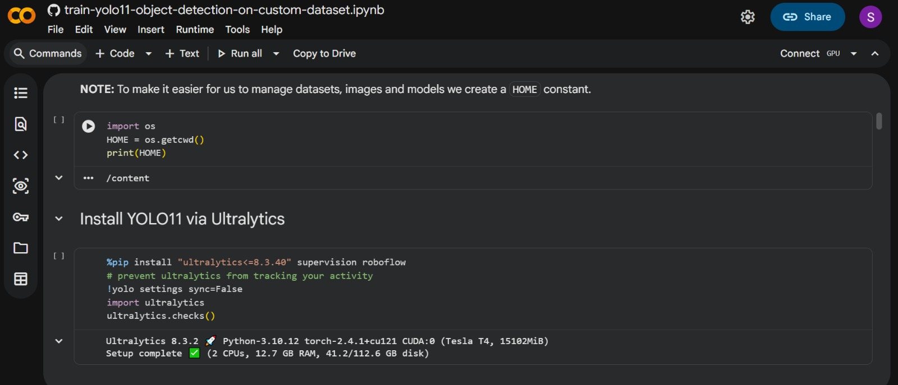

2. Run everything before “Inference with model pre-trained on COCO dataset”(this is not necessary for building the model, but you can run it if you want)

3. Scroll down to “Fine-tune YOLO11 on custom dataset” 

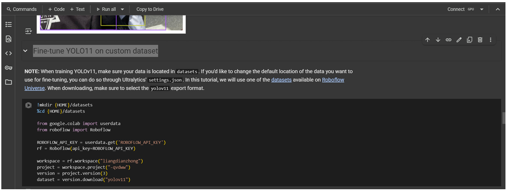

4. Fill in name, Annotation group, select “Object Detection,” and create project: 

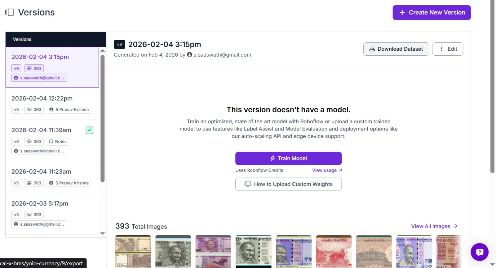

5. Click on “Download Dataset”  

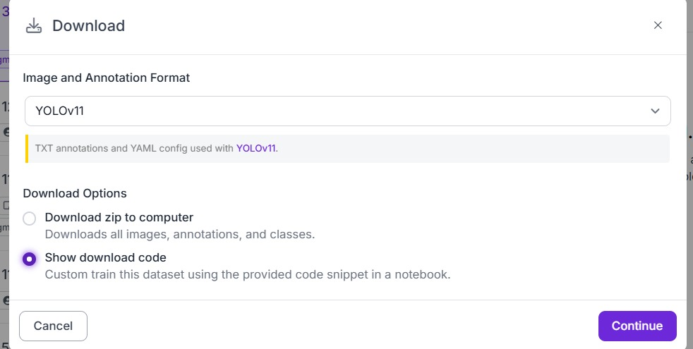

6. Select YOLOv11 and Show download code.  

7. Copy the Snippet  

8.Navigate back to the Collab Document,select the text highlighted below and paste the text from roboflow website 

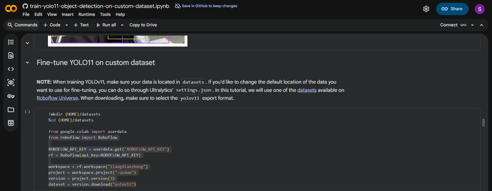

 9. updated snippet looks something like this 

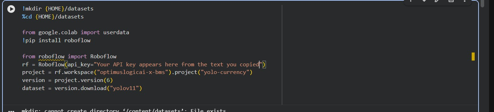

 10. Next to the “model=”, you can chance the size of the model you want to train. Yolo11n is 
the smallest, yolo11l and x are the largest. For now, its fine to use yolo11n. 

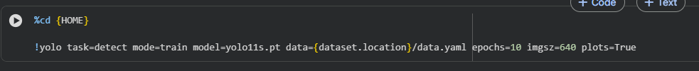 

11. Next to “epochs=’, this determines the amount of cycles your model is trained for. For a final model, 100-300 epochs are usually a good amount. For now, choose anywhere from 10-50 epochs. If you’re unsure, use 10. 

12. Run the snippet and wait for it to finish. This may take a while. 

13. After Runing All the Code Snippets  you will see different images and their IDs 

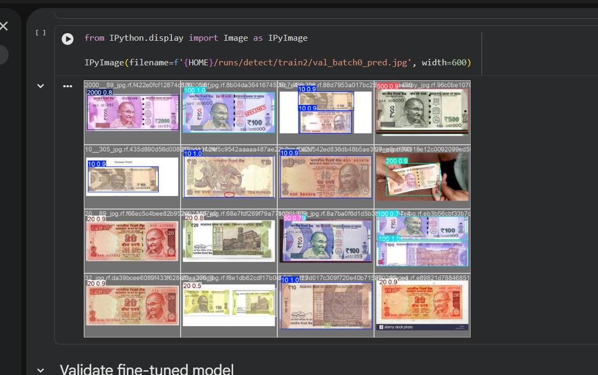

13. Congrats! You now have a fully trained model. 

<h2>Step 4:- Local Deployment</h2>

1. In order to download the trained model onto your computer, open the file browser tab on 
the left 

2. Navigate to datasets → runs → detect → train → weights → look for a file called 
“best.pt” and download it to your computer. 

 3. Open a code editor like Visual Studio Code and create a new python file. 

 4. In Visual Studio Code or any other IDE,Create a Virtual Environment (.venv) 

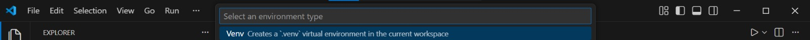

5. Activate the venv and install ultralytics,OpenCV,Numpy using command given below 

6. Make sure that the best.pt file, and Python file that you are going to create now are both in the same directory 

7. Use the code <u>oldeploy1.py</u> given to run the program to test the model and save result to notepad file

8. source = "0"  - change this line from zero to "file path" to give any test images to the model instead of taking it from the webcam

9. Open a new terminal on VS Code in the same venv

10. Enter the command   python -m http.server 8000

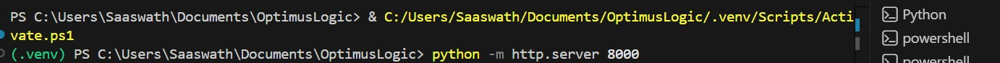

11. This creates a server using port 8000 and the computer acts as server with access granted thru IPv4 address of the computer

12. The txt file can be accessed using  
https://<insert ip address>:8000/detect.txt 

<h2>Final Results</h2>

1. On running the Python Program ,your Computers WebCam will turn on and there will be a live feed on your display as shown below.

2. After Running the Server ,you can open your web browser (Chrome,FireFox,Brave,Edge,Internet Explorer and so on), paste in the Ip Address as mentioned before.You will get the following showen on your web browser.

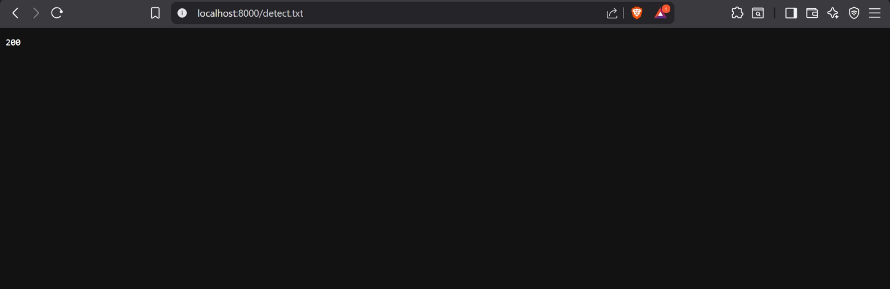
